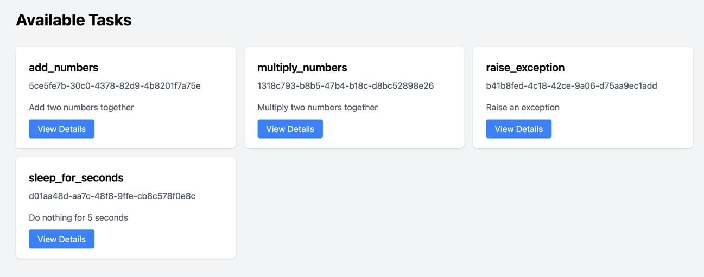
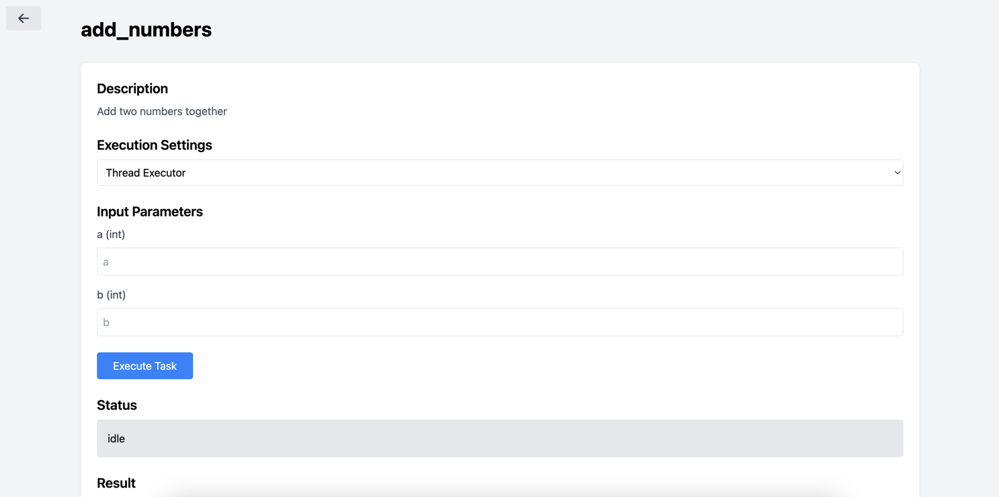

# Distributed Task Execution System

A simple Python-based distributed task execution system that showcases metaprogramming techniques.

## Introduction

- The framework provides a python annotation `@task` and a web interface that can be accessed by running the web app 

  ```python
  from ..src.task.decorators import task
  from ..src.web import app
  
  
  @task
  def add_numbers(a: int, b: int) -> int:
      """Add two numbers together"""
      return a + b
  
  @task
  def multiply_numbers(x: float, y: float) -> float:
      """Multiply two numbers together"""
      return x * y
  
  @task
  def raise_exception():
      """Raise an exception"""
      raise
  
  @task
  def sleep_for_seconds(seconds: int) -> str:
      """Do nothing for 5 seconds"""
      sleep = __import__('time').sleep
      sleep(seconds)
      return "great nap!"
  
  if __name__ == "__main__":
      app.run_server()
  ```
  
- Functions annotated with `@task` are automatically detected by the framework and made available on the web interface

  
  
- The tasks can be executed through the web interface
  - The function input parameters are automatically detected and exposed on the interface
  - Two execution backends are provided (Thread and Docker)
    - Thread: spins up a new thread for execution
    - Docker: spins up a new docker container for execution

  

- The only user defined code is shown above, everything else is handled by the framework by leveraging python metaprogramming techniques

## Features

- Simple task definition using Python decorators
- Multiple execution backends (Thread and Docker)
- Code generation for task execution
- Web-based control plane
- Real-time task status monitoring
- Type-safe task inputs
- Extensible architecture for future enhancements

## Installation

1. Clone the repository
2. Create a virtual environment: `python -m venv .venv`
3. Activate the virtual environment:
   - On Windows: `.venv\Scripts\activate`
   - On macOS and Linux: `source .venv/bin/activate`
4. Install dependencies: `pip install -r requirements.txt`

## Project Structure

- `src/`: Main source code
  - `controller/`: Task execution control
  - `executors/`: Different execution backends
  - `workers/`: Worker templates and generated code
  - `web/`: Web interface and API
  - `task/`: Task decorators and analysis
- `examples/`: Examples


## Usage

### 1. Define Tasks

- Create a new Python file in the `examples` directory:
- Import the `@task` decorator `from ..src.task.decorators import task`
- Import the web server app `from ..src.web import app`
- Write a python function and decorate the function with the `@task` decorator
    - Note: Currently task functions DO NOT support any side effects or dependencies
    - A work-around for standard imports is to use the built-in  `__import__()` function within the task function (refer to the `sleep_for_seconds` example)
  - Example:
      ``` python
      @task 
      def add_numbers(a: int, b: int) -> int:
          """Add two numbers together""" 
          return a + b
      ```
- Add the following to the bottom of the python file
  ``` python
  if __name__ == "__main__":
      app.run_server()
  ```

### 2. Start the Server
- If you are in the /demo1 directory, cd back to the /demo directory
- Run `python -m demo1.examples.simple_tasks`


### 3. Access the Web Interface

Open your browser and navigate to `http://localhost:8000`

## Future Enhancements

- Support for task dependencies
- Parallel execution
- Task scheduling
- More execution backends
- Task monitoring and logging
- Error handling and retries
